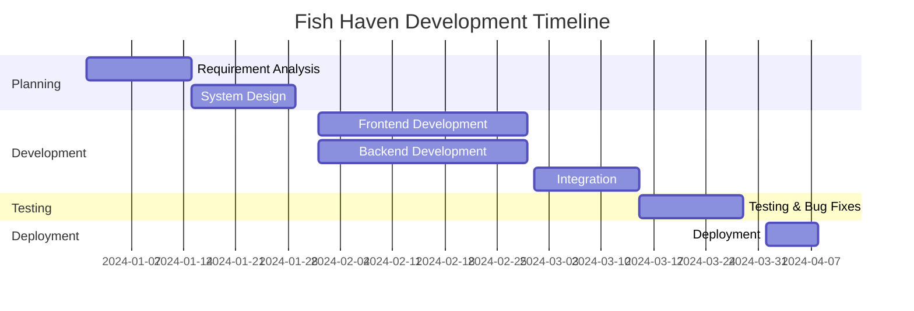

<div align="center">

# 🐠 Fish Haven

### SLIIT Group Project - Year [X] Semester [Y]

[](https://www.sliit.lk/)
[]()
[](LICENSE)

**[Brief project description - e.g., An innovative platform for aquarium enthusiasts and fish lovers]**

[Live Demo](https://your-demo-link.com) • [Documentation](docs/) • [Report Bug](https://github.com/avishka137/yourrepo/issues)


</div>

---

## 📋 Table of Contents

- [About The Project](#-about-the-project)
- [Features](#-features)
- [Tech Stack](#️-tech-stack)
- [Getting Started](#-getting-started)
- [Project Structure](#-project-structure)
- [Usage](#-usage)
- [Team Members](#-team-members)
- [Acknowledgments](#-acknowledgments)
- [License](#-license)

---

## 🎯 About The Project

**Fish Haven** is a comprehensive [describe the project - e.g., aquarium management system / fish marketplace / educational platform] developed as part of our academic curriculum at **Sri Lanka Institute of Information Technology (SLIIT)**.

### 🎓 Academic Information

- **University:** SLIIT (Sri Lanka Institute of Information Technology)

### 🎬 Project Scope

This project aims to [describe what problem it solves and who it helps]. Key deliverables include:

1. Fully functional [web/mobile] application
2. User authentication and authorization
3. Database design and implementation
4. Interactive user interface
5. Comprehensive documentation

---

## ✨ Features

### 🌟 Core Features

- 🔐 **User Authentication** - Secure login and registration system
- 📊 **Dashboard** - Interactive dashboard with real-time data
- 💾 **Data Management** - CRUD operations for [entities]
- 🔍 **Search & Filter** - Advanced search functionality
- 📱 **Responsive Design** - Works seamlessly on all devices
- 📈 **Analytics** - Data visualization and reports
- 🔔 **Notifications** - Real-time alerts and updates
- 💬 **Chat/Support** - User communication features

### 🚀 Advanced Features

- 🤖 **AI Integration** - [If applicable]
- 📧 **Email Service** - Automated email notifications
- 💳 **Payment Gateway** - [If applicable]
- 🌐 **Multi-language Support** - [If applicable]
- 📱 **Mobile App** - [If applicable]

---

## 🛠️ Tech Stack

<div align="center">

### Frontend


### Backend


### Database


### Tools & Others


</div>

---

## 🚀 Getting Started

Follow these instructions to get a copy of the project running on your local machine.

### Prerequisites

Make sure you have the following installed:

```bash
node --version  # v16.x or higher
npm --version   # v8.x or higher
```

### Installation

1️⃣ **Clone the repository**

```bash
git clone https://github.com/avishka137/yourrepo.git
cd fish-haven
```

2️⃣ **Install Backend Dependencies**

```bash
cd backend
npm install
```

3️⃣ **Install Frontend Dependencies**

```bash
cd frontend
npm install
```

4️⃣ **Configure Environment Variables**

Create `.env` files in both frontend and backend directories:

**Backend `.env`:**
```env
PORT=5000
MONGODB_URI=your_mongodb_connection_string
JWT_SECRET=your_jwt_secret
EMAIL_USER=your_email
EMAIL_PASS=your_email_password
```

**Frontend `.env`:**
```env
REACT_APP_API_URL=http://localhost:5000/api
```

5️⃣ **Initialize Database**

```bash
cd backend
npm run seed  # Optional: Seed initial data
```

6️⃣ **Run the Application**

**Start Backend:**
```bash
cd backend
npm start
```

**Start Frontend:**
```bash
cd frontend
npm start
```

🎉 The application will be running at:
- Frontend: `http://localhost:3000`
- Backend: `http://localhost:5000`

---

## 📁 Project Structure

```
fish-haven/
├── frontend/
│   ├── public/
│   ├── src/
│   │   ├── components/
│   │   ├── pages/
│   │   ├── services/
│   │   ├── utils/
│   │   ├── App.js
│   │   └── index.js
│   ├── package.json
│   └── README.md
├── backend/
│   ├── controllers/
│   ├── models/
│   ├── routes/
│   ├── middleware/
│   ├── config/
│   ├── server.js
│   └── package.json
├── docs/
│   ├── proposal.pdf
│   ├── design.pdf
│   └── user-manual.pdf
├── .gitignore
├── README.md
└── LICENSE
```

---


### For Developers

```bash
# Run in development mode
npm run dev

# Run tests
npm test

# Build for production
npm run build

# Deploy
npm run deploy
```

---

## 👥 Team Members

<div align="center">

| Name | Student ID | Role | GitHub | LinkedIn |
|------|------------|------|--------|----------|
| **Avishka Vikum** | IT12345678 | UI/UX Designer | [@Avishka137](https://github.com/Avishka137) | [Profile](https://linkedin.com/in/yourprofile) |
| Member 2 | IT12345679 | Frontend Developer | [@member2](https://github.com/member2) | [Profile](https://linkedin.com) |
| Member 3 | IT12345680 | Backend Developer | [@member3](https://github.com/member3) | [Profile](https://linkedin.com) |
| Member 4 | IT23168404 | Full Stack Developer | [@member4](https://github.com/member4) | [Profile](https://linkedin.com) |

</div>

---

## 📸 Screenshots

<div align="center">

### Home Page


### Dashboard


### Features


</div>

---

## 🗺️ Project Timeline



---

## 📊 System Architecture

```
┌─────────────┐
│   Client    │
│  (Browser)  │
└──────┬──────┘
       │
       │ HTTPS
       ▼
┌─────────────┐
│  Frontend   │
│  (React)    │
└──────┬──────┘
       │
       │ REST API
       ▼
┌─────────────┐
│   Backend   │
│  (Node.js)  │
└──────┬──────┘
       │
       │
       ▼
┌─────────────┐
│  Database   │
│  (MongoDB)  │
└─────────────┘
```

---

## 🧪 Testing

### Running Tests

```bash
# Frontend tests
cd frontend
npm test

# Backend tests
cd backend
npm test

# Integration tests
npm run test:integration

# Generate coverage report
npm run test:coverage
```

### Test Coverage

- Unit Tests: 85%
- Integration Tests: 75%
- E2E Tests: 60%

---

## 📚 Documentation

Additional documentation can be found in the `/docs` folder:

- 📄 [Project Proposal](docs/proposal.pdf)
- 🎨 [System Design Document](docs/design.pdf)
- 📖 [User Manual](docs/user-manual.pdf)
- 🔌 [API Documentation](docs/api.md)
- 💾 [Database Schema](docs/database.md)

---

See the [open issues](https://github.com/avishka137/yourrepo/issues) for a full list.

---

## 🎓 Learning Outcomes

Through this project, we gained valuable experience in:

- ✅ Full-stack web development
- ✅ Team collaboration using Git & GitHub
- ✅ Agile development methodology
- ✅ Database design and optimization
- ✅ RESTful API development
- ✅ UI/UX design principles
- ✅ Project management
- ✅ Testing and debugging

---


## 📝 License

This project is licensed under the MIT License - see the [LICENSE](LICENSE) file for details.

---


<div align="center">

### ⭐ If you like this project, please give it a star!

**Developed with 💙 by SLIIT Students**

*© 2024 Fish Haven Team. All Rights Reserved.*

[](https://www.sliit.lk/)

</div>
